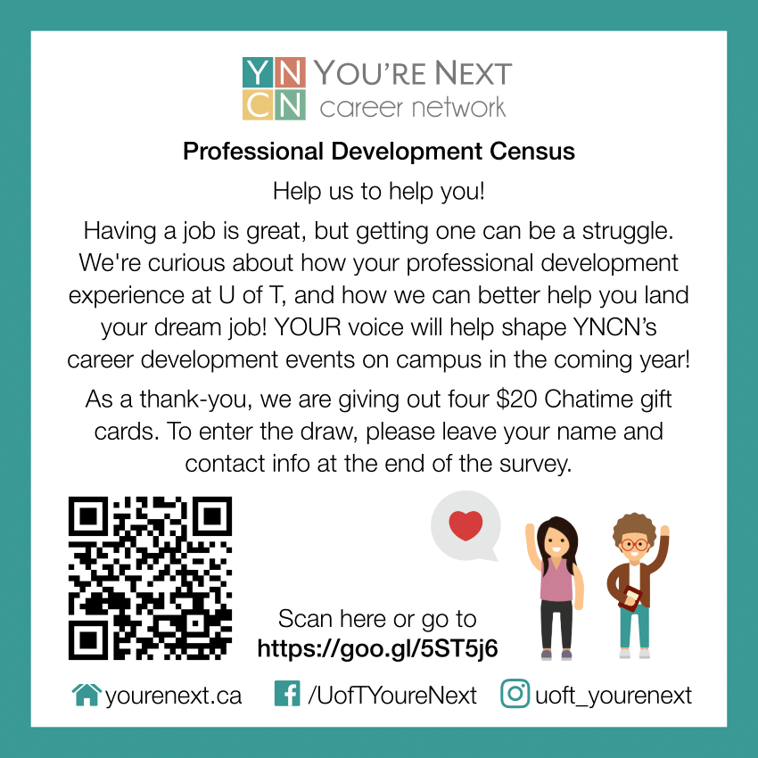

```{r setup, echo=FALSE, include=FALSE}
knitr::opts_chunk$set(echo = FALSE)
source('1 - Load + Clean Data.R')
source('demographic_analysis.R')
source('problem_areas.R')
source('career_goals.R')
source('Marketing Qs Analysis.R')
```

## 1.0 Census Overview

### 1.1 Census Description

The YNCN census is an initiative to assess students' professional development skills and identify their pain points in the job finding process. Our goals is to integrate these insights into our event planning process and marketing strategy to ensure that our offerings are beneficial for students, and directly address their areas of need.

When: September 12th - September 28th

### 1.3 Target Population

The target population for the census was undergraduate students at the University of Toronto, studying Engineering, Commerce, Computer Science, or any other type of quantitive discipline (i.e. Math).

### 1.2 Project Goals

The following goals were set prior to the census so the success of this project could be evaluated.

\begin{enumerate}
  \item Collect data from 200-300 undergraduate students. 
  \item Of the engineering data collected, have at least 5 respondents from every discipline and every year to ensure representaive data.
  \item Gather actionable insights from the data collected. 
  \item Host a teach-in on survey results and how they can help improve YNCN this year.
\end{enumerate}


## 2.0 Marketing Strategy and Branding Overview

### 2.1 Marketing Strategy
 
Marketing strategy was a critical success factor for this project. The number of responses collected was entirely dependant on the work of YNCN team members to distribute the census. To motivate YNCN members to collect census responses, we had an internal competetion between each YNCN team to see who could collect the most responses. The winning team won a pimped out meeting (think champagne, sparkling apple juice, cupcakes, music, etc.) courtesy of the marketing team. Each team had their own version of the census to keep track of responses. 

In addition to the competition, the following marketing strategies were used to collect responses:
 
\begin{enumerate}
  \item Response recruitment in the pit
  \begin{itemize}
    \item Volunteers set up the YNCN banner and a few laptops/tablets at the table at the front of the pit between 11am and 1pm and asked students walking by to fill out the census
    \item This strategy was a great way to get face-to-face interaction with students, increase our brand awareness, and collect a lot of responses
  \end{itemize}
  \item Facebook
  \begin{itemize}
    \item The census was posted in all of the major engineering and discipline groups
  \end{itemize}
  \item In-class marketing
  \begin{itemize}
    \item We reached out to professors teaching courses that focused on professional development/the workplace asking to give a short presentation to students at the beginning of one of their lectures and/or send the census to students on quercus. 
    \item We handed out census info cards (see section 2.2) to students at the beginning of lecture and talked briefly about the goal of the census and how it could help students. For the last two lectures we ran our of info cards and just wrote a bit.ly link to the census on the chalkboard.
  \end{itemize}
  \item First Year Office:
  \begin{itemize}
    \item We reached out to the first year office and they included a blurb about the census in the first year newsletter, and put the census as a talking point on APS 100 TA's syllabus
    \item Our marketing team also had two APS 100 TAs that offered their students food incentives to fill out the census, which was widely successfull.
  \end{itemize}
\end{enumerate}

### 2.2 Graphics Branding
For this event we made 4x4 handouts that included a short description of the census, a QR code & bit.ly link to the census. These cards were handed out when talking to students about the census at the beginning of lectures.


```{r echo=FALSE, out.width='40%', fig.align   = 'center', fig.cap="\\label{fig:figs}Census Handout Card", fig.pos="H"}

```

## 3.0 Results

### 3.1 Response Demographics
One of our goals was to get at least 5 students from every engineering discipline in each year. While we did not reach this goal, we reached our goal of 300 responses, collecting a final count of 463 responses. Below is a breakdown of the responses by discipline and year. See appendix A for a breakdown of responses from each discipline. 


```{r echo=FALSE, fig.height=3, fig.width=3, fig.cap="\\label{fig:figs}Responses per year"}
count_per_year_graph
count_per_disc
```


Our data was primarily composed of first, second, and third year students. In terms of determining student's biggest pain-points in the job-finding process, these are arguably the most important students to gather data from as they will have the least amount of work experience, thus benefiting the most from our professional development offerings. 

The highest represented discilpines were computer engineering, electrical engineering, engineering science, industrial engineering and mechanical engineering. Comparing these proportions to the UofT engineering demographic, these results are expected, with the exception of chemical engineering students who were under represented in our data, and industrial engineering students who were over respresented.

### 3.2 Career Interests

We asked students what types of jobs they were interested in pursuing after graduation. By a significant amount, students are most interested in pursuing a full time corporate position after graduation, and least interested in research and entrepreneurship.

```{r echo=FALSE, fig.height=3, fig.width=7, fig.align   = 'center', fig.cap="\\label{fig:figs}Post grad work interests", fig.pos="H"}
work_type_total_plot
```

This trend was similar between each year. However, you can see that interest in graduate studies declines over each year, with first year students beign the most interest in graduate studies and 4th year students being the least interested.

```{r echo=FALSE, fig.height=4, fig.width=7, fig.align   = 'center', fig.cap="\\label{fig:figs}Post grad work interests per year", fig.pos="H"}
work_type_year_line_prop
```

Looking at interests per discipline, the trend was again similar, with full time corporate opportunities being the most popular response. Below are some key (and expected) differences between disciplines:

\begin{itemize}
  \item Industrial Engineering Students had the highest interest in full time corporate opportunities (>50$\%$) and the least interest in research (<10$\%$). 
  \item Computer Engineering students had the most interest of all the disciplines in pursuing start up opportunities
  \item MSEs, Science/Math students, and Electrical Engineering students had the highest interest in grad school ($\sim$20$\%$)
\end{itemize}

```{r echo=FALSE, fig.height=4, fig.width=7, fig.align   = 'center', fig.cap="\\label{fig:figs}Post grad work interests per discipline", fig.pos="H"}
work_type_disc_line_prop
```

Next, we asked students to rate their exposure to these opportunities to see if their was any discrepency between career interest and exposure to those opportunities. Hi connor this isnt done yet :) 


Lastly, we asked students what industries they were interested in working in. Software had the highest number of interested students (209), with engineering consuting the second highest (163).

```{r echo=FALSE, fig.height=4, fig.width=7,fig.align   = 'center', fig.cap="\\label{fig:figs}Post grad industry interests", fig.pos="H"}
industry_plot_overall
```

Industry interests per discipline can be found below, the first graph are the number of interested students per discipline, and the second graph is the relative proportion of students interested per discipline. For simplicity, management, tech, and engineering consulting have been generalized into consulting.

```{r echo=FALSE, fig.height=4, fig.width=7,  fig.align   = 'center', fig.cap="\\label{fig:figs}Post grad industry interests per discipline - count", fig.pos="H"}
industry_plot_by_program 
```

```{r echo=FALSE, fig.height=4, fig.width=7,  fig.align   = 'center', fig.cap="\\label{fig:figs}Post grad industry interests per discipline - proportion", fig.pos="H"}
industry_disc_line_prop
```
### 3.3 Professional Development

We asked students to rate their own ability to comfortably write an application-ready resume and cover letter, network with industry professionals, and comfortably complete behavioural, technical, and business case interviews. The responses are summarizied below. 

```{r echo=FALSE, fig.height=5, fig.width=8}
average_ratings_graph_lolly
```

```{r echo=FALSE, fig.height=5, fig.width=8}
layered_facet_line
```

Students are least comfortable completing technical and business case based interviews. Breaking this down by discilpline, the trends are similar. Industrial engineering students had the lowest ratings for technical interviews, which may identify and area of opportunity as it's common for industrial engineering students to have to complete a techncial interview for an anaylst positions (i.e. SQL queries, basic code, etc.). Engineering Sceince and Computer Engineering students rated their compentency for business cases the lowest.

We also asked students to optionally let us know what their biggest pain point in the job finding process was. We had 260 responses. Frequency of the keywords "Interview", "Resume", "Cover Letter", and "Networking" can be seen below. 

```{r echo=FALSE, fig.height=5, fig.width=8}
pp_total
```

Given the volume of students mentioning interviews as a part of their biggest pain point in the job finding process, along with the overall average interview ratings of 2.86, it's clear that students struggle most with this area of the job finding process.


### 3.4 Marketing Channels
Our last question in the census asked students about how they hear about YNCN events. As expected, Facebook accounted for the majority of responses.

```{r echo=FALSE, fig.height=4, fig.width=8}
marketing_total
```

However, breaking this down by year, first year students had the lowest responses for Facebook, and about equal responses for word of mouth. This demonstartes the importance to reach out to first years in frish events, in-person marketing, and clubs fair etc., as most first year students are likely not active in Facebook yet.

```{r echo=FALSE, fig.height=4, fig.width=8}
marketing_line_prop
```

#Appendices

###Appendix A


```{r echo=FALSE, fig.height=9, fig.width=8}
facet_disc_year
```

Note that the above graph omitted 14 Track One responses.

###Appendix B
```{r echo=FALSE, fig.height=10, fig.width=8}
ratings_average_facet
```
